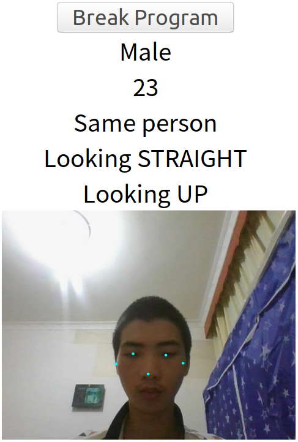
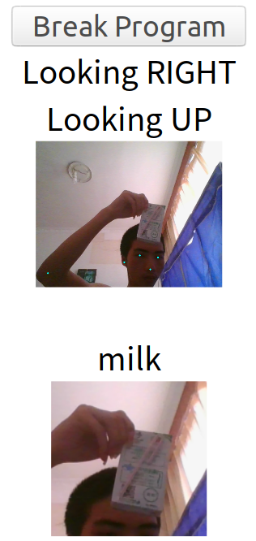
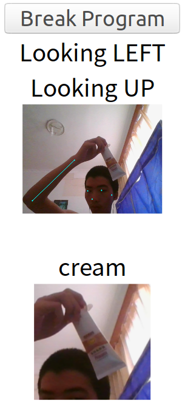

# tensorflowjs-research


### Env
```
yarn
```

### Watch
```
yarn start
```

### Build 
```
yarn build
nodejs serve.js
chrome F12
```

Then go to [http://127.0.0.1:3000](http://127.0.0.1:3000)


### Showcase






___


## A research project run by yingshaoxo to explore possibility of detecting data from webcam.

### feature list:

* Offline

* Age Detection  
* Gender Detection  

* Unique person count  
* Pedestrian count

* Head Pose estimation (looking down)  
* Human Pose Detection (sitting or standing, front or sideway)  

* Object Detection (almost anything from google mobilenet)  


### Main App Design:

async class 
